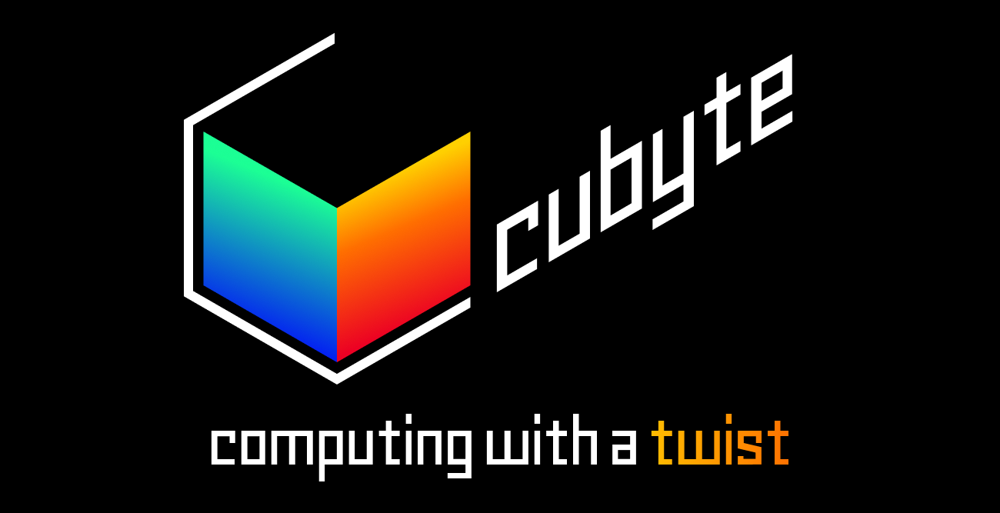
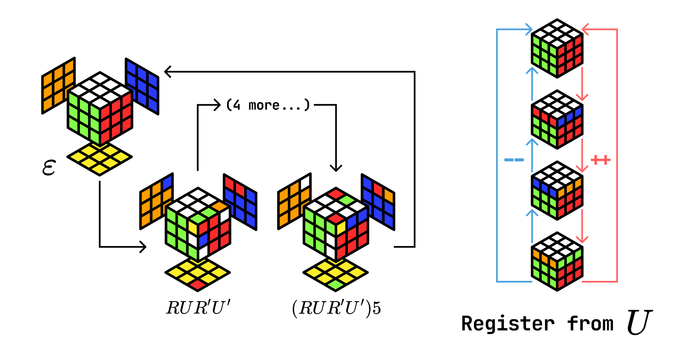
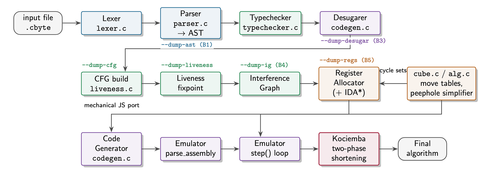

# Cubyte

A compiler and browser emulator for **CuBit** — a programming language whose runtime is a Rubik's cube.

---

## The Idea

CuBit is a register machine where each register is physically realised as a sequence of Rubik's cube moves. The cube is the memory. There is no separate integer store: a variable's value is the number of times its associated algorithm has been applied to the cube, tracked modulo the algorithm's *order* (the number of repetitions after which the cube returns to the same state).

### Registers and algorithms

Every `int` variable is backed by a *register*, which is a cube algorithm with a well-defined order. For example, the algorithm `R U R' U'` has order 6 — applying it six times solves back whatever it disturbed. A variable `x` bound to this algorithm holds the value `v ∈ {0, 1, 2, 3, 4, 5}`: apply the sequence `v` times and that many twists are "stored" in the cube.



Two registers must never disturb the same pieces, so that operations on different variables cannot interfere. The compiler's register allocator searches for mutually disjoint algorithms automatically using an IDA\* solver over the cube's piece structure.

Two registers are always reserved:

- **R0** — the I/O register. `input` and `output` operate on it. The user cannot declare a variable that maps here.
- **R1** — a scratch register used internally by the compiler for variable-copy and subtraction sequences.

User variables are allocated to **R2, R3, …** by the register allocator.

### Arithmetic as cube moves

Because values are stored as repetition counts:

- **Adding 1** means applying the register's algorithm once.
- **Subtracting 1** means applying its inverse once.
- **Setting a register to zero** means detecting when its cycle pieces are solved, then applying the algorithm in a loop until they are.

There are no add or subtract instructions in the assembly output — only raw cube moves and branches.

### Branching on piece positions

The only way to branch is to check whether a set of named pieces is currently solved (back in their home positions). The assembly instruction:

```
branch cycle(UF,UR,UFL) __label
```

jumps to `__label` if the edge `UF`, the edge `UR`, and the corner `UFL` are all solved. Since a register's value is encoded in whether those same pieces are displaced, testing `x = 0` compiles to a branch on the register's cycle set, and testing `x = n` subtracts `n` first, then branches, then restores.

### The piece vocabulary

Pieces are named by the faces they touch:

- **Corners (3 letters):** `UFL`, `UFR`, `UBL`, `UBR`, `DFL`, `DFR`, `DBL`, `DBR`
- **Edges (2 letters):** `UF`, `UB`, `UL`, `UR`, `DF`, `DB`, `DL`, `DR`, `FL`, `FR`, `BL`, `BR`

---

## The Language

Source files use the `.cbyte` extension.

### Variables and types

```cbyte
let int : 6 x := 0;
let int : 4 y := 3;
```

The number after `:` is the *required register order*. Smaller orders are easier for the allocator to find. If the allocator cannot find enough mutually disjoint algorithms the compiler exits with an error.

The reserved identifier `_io` always refers to R0 (the I/O register). It behaves like a regular `int` variable but cannot be redeclared.

### Arithmetic

```cbyte
x := x + 1;
x := x - 2;
x := x + y;
x := y;
```

All arithmetic is modular — values wrap around at the register order.

### Algorithm values

```cbyte
let alg setup := "R U R' U'";
apply setup;
```

`alg` variables are compile-time string constants. `apply` emits the algorithm as raw cube moves (cancellations and opposite-face commutations are simplified before emission).

### I/O

```cbyte
input "Enter an algorithm: ";
output;
output "result";
```

`input` displays a prompt and reads an algorithm typed by the user into R0. `output` drains R0 by animating it until the I/O pieces are solved, printing how many repetitions were needed.

### Conditions and control flow

Conditions can test equality to a constant, equality between two variables, or whether named pieces are solved:

```cbyte
if not (x = 0) {
    x := x - 1;
} else {
    x := 3;
}

while not (rounds = 5) {
    rounds := rounds + 1;
}

if solved [UF, DF, FL, FR, BL] {
    output "score";
}
```

Labels and `goto` are also supported:

```cbyte
start:
    x := x + 1;
    if solved [UF, DF] { goto done; }
    goto start;
done:
    output x;
```

### Comments

 `//` introduces single-line comments.

---

## Examples

All examples live in `examples/`. Each `.cbyte` file has a corresponding pre-compiled `.cubin`.

| File | What it does |
|---|---|
| `counter.cbyte` | Increment a register once and output it |
| `input_echo.cbyte` | Read an algorithm from the user and echo it back |
| `branch.cbyte` | Branch on `solved [...]` to choose an output value |
| `loopish.cbyte` | Count via `goto` until a set of edges is solved |
| `prompt_echo.cbyte` | Loop with arithmetic, a conditional, then I/O |
| `fib.cbyte` | Compute Fibonacci numbers modulo the register order |

---

## Building the Compiler



From the repo root:

```bash
make
```

This produces the `cubyte` binary. The build requires a C17 compiler with AddressSanitizer support (`-fsanitize=address,undefined`). On macOS, the Xcode command-line tools are sufficient.

---

## Compiling a Program

Pass the source path **without** the `.cbyte` extension, then the output `.cubin` path:

```bash
./cubyte examples/counter examples/counter.cubin
```

The compiler reads `examples/counter.cbyte` and writes `examples/counter.cubin`. It also creates `examples/counter-pp.cbyte`, a preprocessed (comment-stripped) intermediate that can be ignored or deleted.

### Debug flags

Flags go before the input path:

```bash
./cubyte --dump-ast      examples/counter /tmp/out.cubin
./cubyte --dump-desugar  examples/counter /tmp/out.cubin
./cubyte --dump-cfg      examples/counter /tmp/out.cubin
./cubyte --dump-liveness examples/counter /tmp/out.cubin
./cubyte --dump-ig       examples/counter /tmp/out.cubin
./cubyte --dump-regs     examples/counter /tmp/out.cubin
```

| Flag | Output |
|---|---|
| `--dump-ast` | Parsed AST with resolved types |
| `--dump-desugar` | AST after the desugaring pass (all assignments in primitive form) |
| `--dump-cfg` | Control-flow graph node list with successor IDs |
| `--dump-liveness` | Live-in and live-out sets per CFG node |
| `--dump-ig` | Interference graph adjacency list |
| `--dump-regs` | Variable-to-register mapping with algorithm, order, and cycle set |

### Exit codes

| Code | Meaning |
|---|---|
| 0 | Success |
| 1 | Lexer error |
| 2 | Parse error |
| 3 | Type error |
| 4 | Register allocator exhausted (no disjoint algorithm found) |
| 5 | Internal compiler error |

All errors print one line to stderr: `[stage] line N: message`.

---

## The Assembly Format (`.cubin`)

A `.cubin` file begins with a register manifest followed by numbered instructions:

```
; reg 0 alg="D L2 U' B2 U R2 F2" order=18
; reg 1 alg="F2 U2 R2 B2 L2 D'" order=4

1  D L2 U' B2 U R2 F2
2  __loop_0:
3  branch cycle(UFL,UFR,UBL,UBR) __loop_done_1
4  R D2 L R2 D2 R B2 L
5  goto __loop_0
6  __loop_done_1:
7  output
```

Each manifest line declares a physical register's algorithm, its order, and implicitly its cycle set (derived from which pieces the algorithm displaces). The emulator uses the manifest to set up registers before running.

Instruction forms:

| Form | Effect |
|---|---|
| `<moves>` | Apply the raw move sequence to the cube |
| `branch cycle(<pieces>) <label>` | Jump if all named pieces are solved; `cycle()` tests all 48 facelets |
| `goto <label>` | Unconditional jump |
| `input "<prompt>"` | Display prompt, read user algorithm into R0 |
| `output` | Drain R0, print repetition count |
| `output "<label>"` | Same, prefixed with label |
| `<label>:` | Define a branch target |

---

## The Visualiser


### Starting the visualiser

For basic playback, open `visualiser/index.html` directly in any modern browser — no server required.

To enable **Run Simplified** with full Kociemba optimisation, first build the solver and start the local server:

```bash
# Build the Kociemba binary (once)
make -C third_party/ckociemba

# Start the server
node visualiser/server.js
```

Then open `http://localhost:3000` instead of the file directly.

### Input mode

A selector in the top-right of the program panel switches between two modes:

- **CuBit Assembly** — paste `.cubin` content directly. Works offline with no server.
- **CuByte Source** — write or paste `.cbyte` source. Requires the local server; the visualiser compiles it on the fly when you click Run. Compiler errors appear in the error panel below the run buttons. Run Line is not available in this mode.

The default content in each mode is a working example you can run immediately.

### Controls

| Control | Action |
|---|---|
| **Run** | Execute the entire program and animate every move |
| **Run Simplified** | Compute the optimal equivalent move sequence, then animate it |
| **Run Line** | Execute one assembly instruction and pause (CuBit Assembly mode only) |
| **⏮ ‹ ▶ › ⏭** | Reset / previous move / play-pause / next move / skip to end |
| **Speed slider** | Adjust animation speed |

### Run Simplified

**Run Simplified** executes the program, takes a snapshot of the resulting cube state, and finds the shortest sequence of moves that produces that same state.

- If the local server is running, the Kociemba two-phase solver is used, guaranteeing an optimal (≤ 20 move) solution.
- If the server is not reachable, the visualiser falls back to algebraic simplification: adjacent same-face moves are collapsed and opposite-face pairs are commuted into canonical order.

The log panel shows which method was used and the before/after move count.

### What you see

- The 3D cube on the left animates each move as the program runs.
- The move sequence is shown in the overlay panel; the current move is highlighted.
- `input` statements pause execution and open a prompt for a value.
- `output` prints the result to the log panel below the program.
- Parse errors appear in red above the run buttons.

### Hand-written assembly

You can write `.cubin` files by hand for experimentation. Declare registers in manifest lines at the top, then write numbered instructions. The default textarea content is a valid example to start from.

---

## Project Structure

```
cubyte          compiler binary (after make)
src/            compiler source (C17)
include/        public headers
examples/       .cbyte sources and pre-compiled .cubin files
visualiser/     browser emulator (HTML + JS)
docs/           design documents and assembly grammar
tests/          unit test drivers
third_party/    ckociemba (cube solver, used by the register allocator)
```
